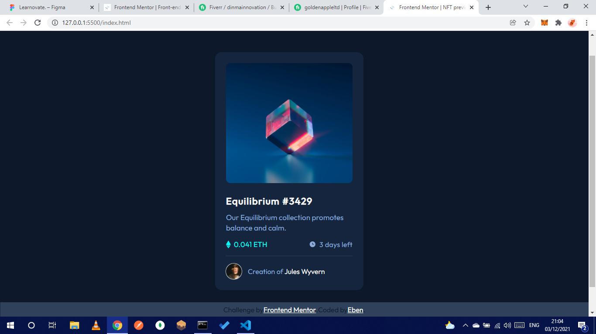

# Frontend Mentor - NFT preview card component solution

This is a solution to the [NFT preview card component challenge on Frontend Mentor](https://www.frontendmentor.io/challenges/nft-preview-card-component-SbdUL_w0U). Frontend Mentor challenges help you improve your coding skills by building realistic projects.

## Table of contents

-   [Overview](#overview)
    -   [The challenge](#the-challenge)
    -   [Screenshot](#screenshot)
    -   [Links](#links)
-   [My process](#my-process)
    -   [Built with](#built-with)
    -   [What I learned](#what-i-learned)
    -   [Continued development](#continued-development)
    -   [Useful resources](#useful-resources)
-   [Author](#author)

## Overview

It was a fun challenge and it was very useful in reminding myself on some CSS tricks

### The challenge

Check my result
Users should be able to:

-   View the optimal layout depending on their device's screen size
-   See hover states for interactive elements

### Screenshot



### Links

https://github.com/E-Zbox/nft-preview-card-component-main

## My process

HTML, CSS SASS precompiler

### Built with

-   CSS
-   SASS
-   flexbox
-   grid
-   hover state
-   mobile responsiveness (though it consists about 5% of SASS code)
-   sass variables

**Note: These are just examples. Delete this note and replace the list above with your own choices**

### What I learned

```html
<div class="card-price-duration">
    <div class="price">
        <svg width="11" height="18" xmlns="http://www.w3.org/2000/svg">
            <path
                d="M11 10.216 5.5 18 0 10.216l5.5 3.263 5.5-3.262ZM5.5 0l5.496 9.169L5.5 12.43 0 9.17 5.5 0Z"
                fill="#00FFF8"
            />
        </svg>
        <p class="price">0.041 ETH</p>
    </div>
    <div class="duration">
        <svg width="17" height="17" xmlns="http://www.w3.org/2000/svg"></svg>
    </div>
</div>
```

```css
.card-price-duration {
    display: flex;
    flex-direction: row;
    justify-content: space-between;
    margin-bottom: calc(var(--ten-px) * 0.7);
    .price,
    .duration {
        display: flex;
        flex-direction: row;
        align-items: center;
        p.price,
        p.duration {
            padding-left: var(--seven-px);
            line-height: 0;
        }
```

### Useful resources

to learn more about CSS grid and flexbox visit YouTube application. Resourceful content can be found there.

## Author

_Chukwunyerem_ zboxstudios97@gmail.com

-   Fiverr - [@dinmainnovations](https://www.fiverr.com/dinmainnovations.com)
-   Frontend Mentor - [@ceoCodes](https://www.frontendmentor.io/profile/E-Zbox)
-   Twitter - [@ceoCodes](https://www.twitter.com/ceoCodes)
